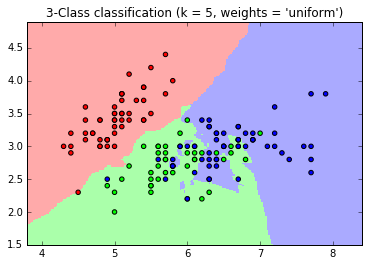
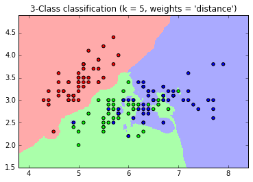
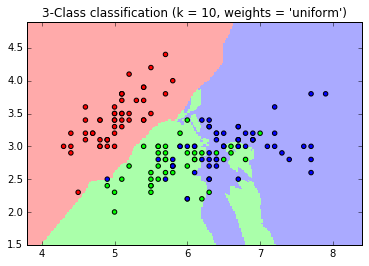
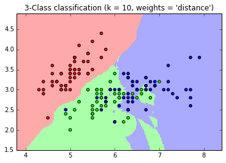
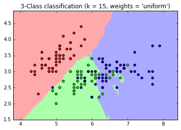
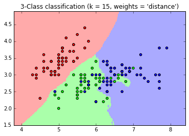
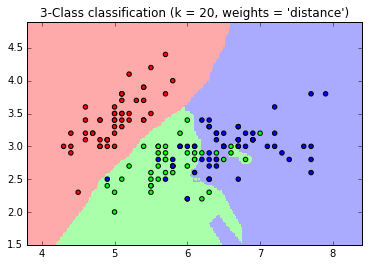
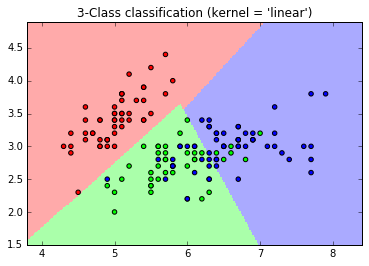
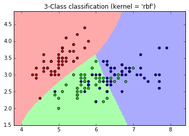

### Explore the effects for different K in K Nearest Neighbor classification.

I varied k value from 5 to 20.

### k = 5

### k = 10

### k = 15

### k = 20

### Explain how we should choose K.
From the above plot we can see that for smaller value of K there is more noise. And when k is very big our boundary for dominating outcome increases. So we should not select a lower value or very high value of k.

### Explore different kernels of Support Vector Machine.
#### Kernel = linear

#### Kernel = RBF

### Explian how we should choose the kernel.
From the plots we can see that choice of kernel depends upon the data. While linear kernel draws linear boundary, rbf does different.
