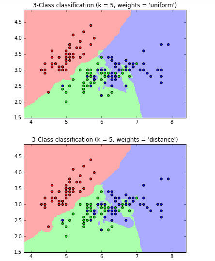
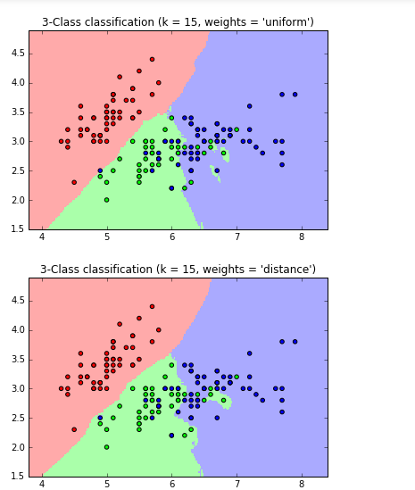
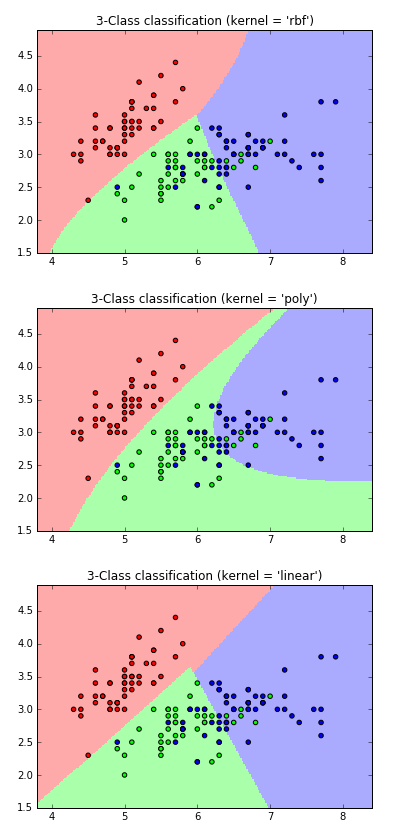

## K Nearest Neighbor classification. Plot for different K values .

I varied k value from 5 , 15,  20.

### k = 5

### k = 15

### k = 25

## Explore different kernels of Support Vector Machine

